# Introduction

This manuscript documents the work performed at the Bioconductor Spatial
Data and Image Analysis Hackathon, held in Venice, Italy in April 2026.
The hackathon brought together 27 researchers and software developers to
advance Bioconductor capabilities in spatial data handling, analysis,
and image analysis. Work was organized into team projects spanning three
days, with each team independently scoping and executing on a challenge
important to its members.

## Schedule and structure {#sec-schedule}

Each day began at 09:00 with a brief plenary across all teams. Coffee
breaks at 10:30 and 15:30, plus a 12:30--13:30 lunch, gave teams
structured opportunities to compare notes. Days 1 and 2 ended at 17:00
with five-minute single-slide updates from each team. Day 1 also
included a mid-day plan presentation right after lunch. The mid-day plan
helped teams converge quickly on a focused project, with the explicit
understanding that the plan would evolve over the next two days. The
end-of-day summaries surfaced shared challenges and made cross-team
progress visible.

  -----------------------------------------------------------------------
  Time            Activity
  --------------- -------------------------------------------------------
  09:00           Brief plenary with all teams

  10:30           Coffee break

  12:30 -- 13:30  Lunch

  13:30 (Day 1)   Initial project plan, one slide per team

  15:30           Coffee break

  17:00 (Days     End-of-day team summaries, one slide per team
  1--2)           
  -----------------------------------------------------------------------

Each team worked in a public GitHub repository created and maintained
throughout the three days. The `README.md` was emphasized as the entry
point, on the premise that future collaboration and visibility scale
with a strong landing page.

Each team also designated a writer responsible for contributing to this
manuscript. Author and conflict-of-interest information was collected in
a shared spreadsheet for attribution. A short writers' meeting on the
morning of day 3 agreed on figure and text contribution mechanics;
writers then worked with their teams through the afternoon to complete
drafts before departing.

## Hackathon teams {#sec-teams}

Participants self-organized into four teams:

1.  Image and segmentation data manipulation and visualization
    ([Section 2](#sec-image-analysis){.quarto-xref})
2.  Spatial foundation models for the Bioconductor community
    ([Section 3](#sec-foundation-models){.quarto-xref})
3.  Spatially stratified differential expression analysis
    ([Section 4](#sec-stratified-de){.quarto-xref})
4.  Enhanced infrastructure and interoperability for spatial data in
    Bioconductor ([Section 5](#sec-interoperability){.quarto-xref})

The remainder of this manuscript reports each team's work in a common
four-part structure --- motivation, methods, results, and discussion and
next steps --- followed by a cross-cutting discussion that draws out
themes shared across the projects.

# Image and segmentation data manipulation and visualization {#sec-image-analysis}

Source code: <https://github.com/drisso/segmentation-analysis>

## Motivation

Spatial omics and digital pathology have moved from low-plex imaging to
gigapixel whole-slide datasets. These datasets typically pair
multi-gigabyte whole-slide images (WSIs) with segmentation masks
identifying hundreds of thousands to millions of nuclei or cell
boundaries. The work reported here focuses on classical pathology images
(hematoxylin and eosin, H&E), illustrated with an example from The
Cancer Imaging Archive^1^; the methodology generalizes to spatial
transcriptomics data when H&E or immunofluorescence images accompany
transcriptomic profiles, which is the case for most modern datasets.

The Python ecosystem offers powerful frameworks for spatial image
processing, including `spatialdata`^2^. R/Bioconductor has a comparably
mature suite of geostatistical and geographical analysis tools ---
`terra`, `sf`^3^, and `spatstat`^4^ --- but as image sizes and cell
counts grow, R users hit a "raster--polygon bottleneck": the inability
to efficiently extract image features from massive rasters and intersect
them with millions of polygons without exceeding system memory.

The core problem addressed here is enabling **scalable image feature
extraction** in R. Bridging cloud-optimized image formats (Zarr) with
high-performance spatial databases (GeoParquet) makes R's specialized
spatial-statistics tooling available to digital-pathology workloads at
whole-slide scale. Building on the same foundation, an interactive
Shiny + Plotly workflow lets users select arbitrary regions of interest
(ROIs) directly from a tissue image and feed those polygons into the
same lazy subsetting pipeline.

## Methods

The methodological work targeted efficient reading and cropping of large
OME-TIFF and Zarr images, and efficient subsetting of large polygon
collections in R. The resulting pipeline prioritizes memory efficiency
by never materializing more data than needed for a single processing
window, using **GeoParquet** for polygon storage and **OME-Zarr** for
image storage.

### Example data

The test image is the H&E slide
`TCGA-02-0001-01Z-00-DX1.83fce43e-42ac-4dcd-b156-2908e75f2e47` from
TCGA, retrieved via the `imageTCGA` Bioconductor package^5^. The
original SVS image was converted into OME-TIFF and OME-Zarr; it has
three channels (RGB) and 35,558 × 48,002 pixels, and the Zarr file
contains 48 chunks of shape 3 × 6,688 × 6,688.

`imageTCGA` also provides nuclear segmentations from HoVer-Net^6^.
Polygons are originally distributed as GeoJSON; a GeoParquet version was
produced for this work. The polygon file contains 333,207 polygons, with
a 2× scale factor between polygon and image coordinates (the polygons
assume 40× magnification while the image is 20×).

### Technical stack

  ----------------------------------------------------------------------------------------
  Component                   Role              Reference
  --------------------------- ----------------- ------------------------------------------
  OME-Zarr                    Cloud-optimized   [zarr.dev](https://zarr.dev)
                              chunked image     
                              format used to    
                              store the H&E     
                              pixels.           

  GeoParquet                  Columnar polygon  [geoparquet.org](https://geoparquet.org)
                              storage with      
                              bounding-box      
                              metadata for fast 
                              spatial           
                              filtering.        

  **terra**                   Lazy raster       ^7^
                              loading and       
                              raster--vector    
                              intersection      
                              (originally for   
                              satellite         
                              imagery).         

  **DuckDB** +                Out-of-memory     ^8^
  **duckspatial**             spatial filtering 
                              --- query         
                              million-row       
                              polygon files as  
                              if they were a    
                              local database.   

  **ZarrArray**               `DelayedArray`    ^9,10^
                              backend for       
                              native Zarr       
                              access within     
                              Bioconductor.     
  ----------------------------------------------------------------------------------------

### Algorithm

Rather than iterating over polygons (the "vector-first" approach), the
algorithm iterates over the **intrinsic Zarr chunks** of the image (the
"raster-first" approach). For each chunk $C_{i,j}$:

1.  **Spatial fetch.** A SQL query is pushed to the Parquet file to
    retrieve only polygons $P$ where
    $\mathrm{BBox}(P) \cap \mathrm{BBox}(C_{i,j}) \neq \emptyset$.
2.  **Lazy read.** The image data for $C_{i,j}$ is read into memory.
3.  **Rasterize.** The selected polygons are rasterized into a label
    mask.
4.  **Compute.** Per-channel pixel statistics (e.g., mean intensity) are
    computed for each labeled object.

The main difficulty is the *border effect*
([Figure 1](#fig-border-effect){.quarto-xref} A): each chunk should be
read only once, but when a polygon straddles two chunks the in-memory
pixel set for one chunk is incomplete. A pixel-accumulation strategy
resolves this ([Figure 1](#fig-border-effect){.quarto-xref} B): when a
polygon partially overlaps a chunk, the rasterized partial pixel set is
stored under the polygon's identifier; when the adjacent chunk is
processed, the buffer is extended and statistics are computed only once
the polygon is complete.

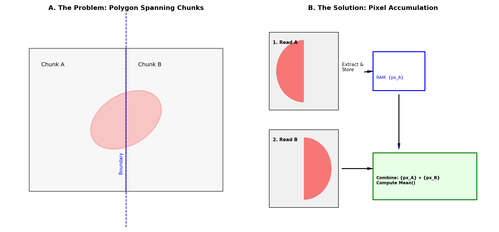{width="80%"}

### Interactive ROI selection

Building on the rasterisation primitives in `terra`, an interactive
ROI-selection workflow uses `plotly`^11^ to let users draw arbitrary
polygons over a tissue image --- demonstrated here on the mouse ileum
profiled by MERFISH (accessed via ExperimentHub ID `EH7543`)^12,13^ as
proof of concept. User-drawn polygons are returned as coordinate
geometries and converted into spatial vector objects. The ROI is then
materialized through the same lazy pipeline used elsewhere in the
section: transcript coordinates are filtered with out-of-memory
operations in `duckspatial`, and the underlying image is cropped with
`terra` and visualised with `tidyterra`^14^.

## Results

### Random access to polygon files

Pushing spatial queries to an out-of-memory Parquet file substantially
outperforms traditional GeoJSON-based workflows, enabling whole-slide
analyses on standard workstations. While `duckspatial` works with both
formats, polygon subsetting was approximately 50× faster on GeoParquet
than on GeoJSON.

### Cropping and visualization of large images

Reading, cropping, and visualizing large OME-TIFF images is efficient
using `terra`'s `rast()` and `crop()`. For OME-Zarr, combining
`ZarrArray` subsetting with `terra::rast()` works equally well. The
intersection of high-speed polygon queries with high-resolution
pathology crops is illustrated in
[Figure 2](#fig-segmentation-overlay){.quarto-xref}.

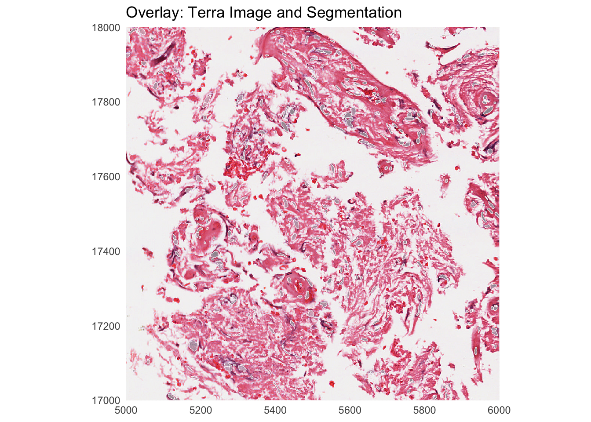{width="80%"}

### Mask creation and statistics computation

Combining the components above, a prototype implementation:

- iterates over Zarr image chunks,
- selects polygons overlapping each chunk,
- rasterizes them into an image mask, and
- computes mean per-channel pixel intensity over each segmented object.

On the example image, the analysis runs in $986 \pm 2$ seconds using R
4.5.3 on a MacBook Pro with an Apple M5 chip, 10-core CPU, 32 GB RAM,
and local-SSD image data. The workflow reads only the relevant
cell-boundary shapes and Zarr image data for each chunk, avoiding
full-image materialization; loading the full image into memory on the
same machine resulted in an out-of-memory error.

### Interactive ROI selection in practice

The Shiny + Plotly application described in Methods exposes the lazy
subsetting pipeline through a point-and-click interface: an analyst
draws an arbitrary polygon over a tissue image, the polygon coordinates
are exported as a spatial vector object, and the underlying image and
spatial-transcriptomics data are subset to that region for visualisation
and downstream analysis of tissue compartments.

## Discussion and next steps

The combination of OME-Zarr image storage, GeoParquet polygon storage,
and DuckDB spatial queries makes whole-slide pathology analysis
tractable in R on commodity hardware, without rewriting the underlying
spatial-statistics tooling. Pushing predicates into chunked, indexed
storage rather than loading data into R is the central design choice,
and the same pattern recurs across the other hackathon teams.

The current prototype skips polygons that straddle multiple chunks,
sidestepping the border effect described in
[Figure 1](#fig-border-effect){.quarto-xref}. Implementing the full
pixel-accumulation strategy is the natural next step. Additional
priorities are packaging the chunk-iteration loop into reusable
utilities, validating performance on larger and more diverse datasets,
and integrating the workflow with downstream Bioconductor packages for
cell-level analysis.

# Spatial foundation models for the Bioconductor community {#sec-foundation-models}

Source code: <https://github.com/drighelli/fomo>

## Motivation

Foundation models for spatial data are predominantly distributed as
Python packages, and configuring them for a particular compute
environment is often fragile: most have specific version dependencies
that are not always documented, even when the model is on PyPI. This
makes individual models hard to install for many R users and makes
reproducible benchmarking across models onerous. A second gap is
representational: most Python tools expect `AnnData`, while the natural
Bioconductor container for spatial data is `SpatialExperiment`, so any
reusable wrapper has to reconcile the two. The `fomo` package addresses
both problems.

## Methods

### Package design

`fomo` configures and runs foundation-model pipelines from R. It uses
`basilisk` and `reticulate` to build separate environments per model
([Figure 3](#fig-bfg-schema){.quarto-xref}), avoiding the dependency
conflicts that arise when attempting to satisfy all models in a single
environment. The package ships a collection of `BasiliskEnvironment`
schemas that pin a Python version and the required PyPI dependencies for
each model. For models not on PyPI, `fomo` provides template scripts to
build environments via `reticulate`.

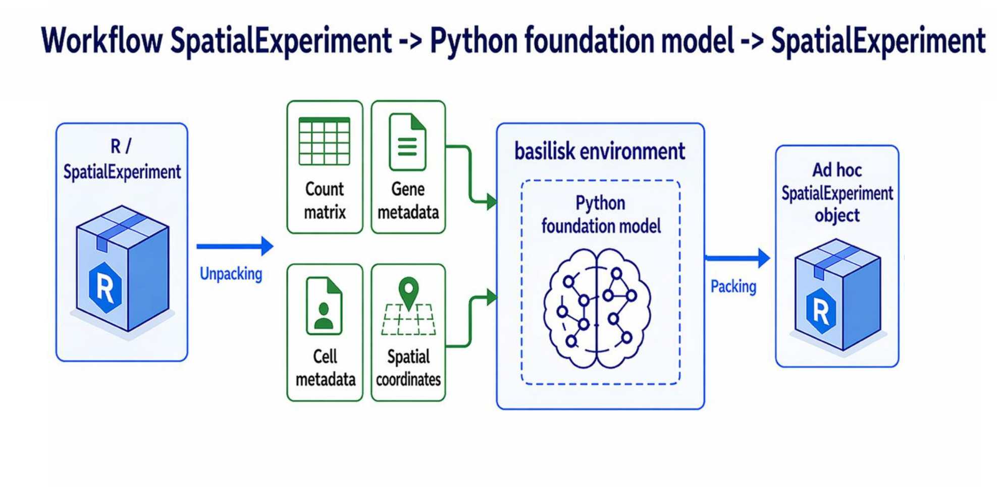{width="85%"}

For each supported model, the package exports a `Run_<model>()` function
(e.g., `Run_novae()`). The package focuses on **zero-shot** use of
pre-trained models: input data are passed in and embeddings come back,
with no fine-tuning required. The final design takes a
`SpatialExperiment` as input and writes embeddings to its `reducedDims`
slot.

### Models

Six models spanning the breadth of current spatial-foundation use cases
were prioritized ([Table 3](#tbl-bfg-models){.quarto-xref}). Wherever
possible, weights are pulled from Hugging Face so the entire workflow
runs through the package; the exception is scGPT, which uses upstream
PyTorch checkpoints.

  -----------------------------------------------------------------------------------------------------------
   Status  Model               Category           PyPI  Primary input    Output             Embedding size
  -------- ------------------- ----------------- ------ ---------------- ------------------ -----------------
     ✅    scGPT^15^           Single-cell         ✅   Gene counts      Cell embeddings    512
                               transcriptomics                                              

     🟡    scFoundation^16^    Single-cell         ✅   Gene counts      Gene / cell        3072
                               transcriptomics                           embeddings         

     ✅    Novae^17^           Spatial             ✅   Gene counts +    Neighbor-context   64
                               transcriptomics          spatial coords   embedding +        
                                                                         zero-shot domains  

     🟡    Prov-GigaPath^18^   H&E imaging         ❌   H&E WSI tiles    Tile / slide       tile 1536, slide
                                                                         embeddings         768

     ✅    Nimbus^19^          Spatial             ✅   Multiplex TIFF + Per-cell           ---
                               proteomics               segmentation     expression         
                                                        mask             estimates and      
                                                                         annotations        

     ❌    KRONOS^20^          Spatial             ❌   TIFF + mask +    Per-patch          384
                               proteomics               marker           embeddings         
                                                        annotation                          
  -----------------------------------------------------------------------------------------------------------

**scGPT.** Although not designed for spatial data, transcriptional
profiles from spatial assays can be passed through it for comparison
with spatial-specific models. (A spatial extension is available^21^ but
not yet integrated.) The implementation uses upstream PyTorch
checkpoints (`.pt` plus support `.json` files) rather than the Hugging
Face port, because scGPT distributes multiple pretrained checkpoints and
working with them directly preserves user choice. `Run_scGPT()` takes
the path to an `.h5ad` file and the directory containing the pretrained
model.

**Novae.** Embeddings are accessible from the returned `AnnData` at
`adata$obsm$novae_latent` and domain assignments at
`adata$obs$novae_domains_7`. Novae runs on CUDA GPUs and Apple Metal
Performance Shaders (MPS).

**Prov-GigaPath.** Integration is in progress. The current blocker is
provisioning the Python environment on remote GPU servers: the required
Python build is slow to download and a robust install pattern for that
setting is still being worked out.

**Nimbus.** Operates marker by marker across the multiplexed image,
which makes it portable across multiplexed-imaging platforms with
different channel counts.

### `SpatialExperiment` ↔ `AnnData` conversion via `anndataR`

Because most Python tools expect `AnnData`, `anndataR` was extended to
support bidirectional conversion between `SpatialExperiment` and
`AnnData` --- layering a spatially aware translation on top of the
existing `SingleCellExperiment` conversion framework. Canonical mappings
for assays, feature- and cell-level annotations, dimensionality
reductions, and graph-like pairwise structures are preserved; the new
logic adds explicit handling for spatial state. Forward (R → Python),
`spatialCoords` are serialized to `obsm["spatial"]` and image metadata
from `imgData` is written to `uns["spatial"]` in a library-indexed
nested layout compatible with Scanpy conventions; in reverse (Python →
R), those structures are parsed to reconstruct `SpatialExperiment`
objects with restored coordinates and images.

The central difficulty is that `SpatialExperiment` carries semantics
that are not native to `AnnData`: spatial coordinates are not generic
embeddings, image metadata are heterogeneous and partially
technology-specific, and multi-library datasets require deterministic
reconciliation between observation-level sample annotations and
image-level library identifiers. Reserved spatial keys, conflict checks
against user-defined `obsm` and `uns` mappings, and a round-trip
metadata container under `uns["anndataR_spatialexperiment"]` together
preserve otherwise non-canonical information (original coordinate names,
selected spatial keys, library identifier provenance, image export
mode). Image payloads can be embedded, referenced, or omitted to balance
interoperability, file size, and reversibility.

The current development branch can be installed with:

``` r
remotes::install_github("drighelli/anndataR@from_as_spe")
```

## Results

This section reports two complementary results: a use case demonstrating
zero-shot application of a current spatial-proteomics foundation model
(KRONOS), and a status report on the `SpatialExperiment` ↔ `AnnData`
conversion that underpins R-side use of all the wrapped models.

### KRONOS use case

KRONOS^20^ is a foundation model purpose-built for spatial proteomics.
It was trained on more than 47 million image patches covering 16 tissue
types and 175 protein markers, and uses a Vision Transformer based on
DINOv2 modified to handle highly multiplexed images. KRONOS extracts
384-dimensional embeddings for each patch, which can be used for cell
phenotyping, artifact detection, or outcome prediction.

Because KRONOS is not distributed as a Python package, it does not yet
fit the `fomo` envelope and was instead explored directly in a use case
of interest. Starting from a multiplexed image with \~56 channels
([Figure 4](#fig-kronos-input){.quarto-xref}), KRONOS was applied to 128
× 128 sliding windows to obtain feature vectors. PCA of these
embeddings, viewed spatially as RGB-mapped per-window boxes, immediately
surfaces a clear image artifact
([Figure 5](#fig-kronos-pca){.quarto-xref}).

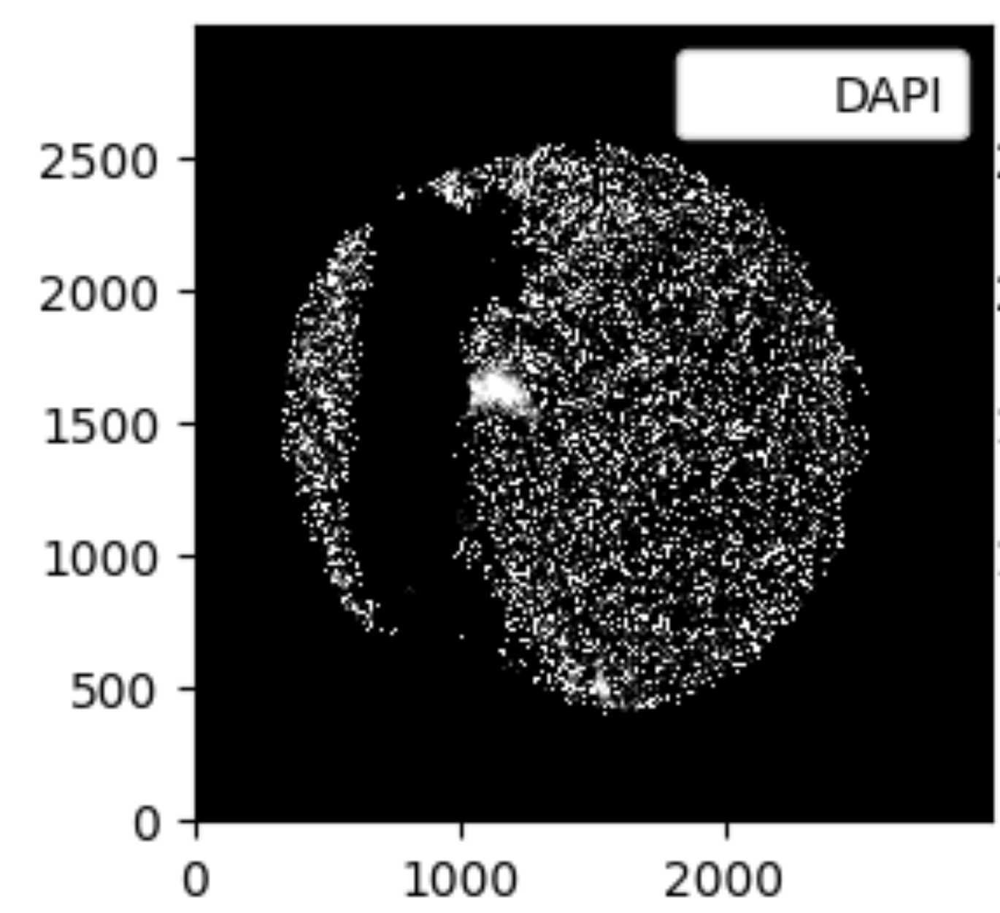{width="70%"}

{width="70%"}

### Conversion testing

Preliminary evaluation of the `SpatialExperiment` ↔ `AnnData` converter
surfaces discrepancies in specific configurations, particularly those
involving technology-specific spatial metadata or image representations.
The reproducibility case study in the `renovae` repository
(<https://github.com/sales-lab/renovae>) documents one such mismatch and
helps locate the remaining failure points before the work is upstreamed
as a pull request to `anndataR`.

## Discussion and next steps

The `fomo` envelope reduces the per-model setup burden to a package
install for the models it covers, and the `anndataR` extension closes
the representational gap between `SpatialExperiment` and `AnnData` for
the spatial state Python tools depend on. Continued work falls into
three areas: completing the wrappers for scFoundation and Prov-GigaPath;
designing a robust pattern for models distributed outside PyPI (KRONOS
in particular); and resolving the remaining `SpatialExperiment` ↔
`AnnData` round-trip discrepancies before upstreaming the converter. A
standardized benchmarking interface across models is the natural
follow-on once the wrapper set is complete.

# Spatially stratified differential expression analysis {#sec-stratified-de}

Source code: <https://github.com/mcalgaro93/SpatialStratifiedDE>

## Motivation

Spatial data are a powerful platform for differential expression (DE)
analyses, letting analysts interrogate how a given cell type changes
phenotype or expression in response to its environment --- for example,
how tumor cells respond to T-cell attack, or how fibroblast expression
changes in regions of tissue damage.

This kind of phenotype--environment DE testing is typically performed at
the level of whole studies or whole tissues. That has two important
limitations. First, it ignores spatial autocorrelation in gene
expression, leading to biased estimates and overconfident standard
errors. Second, it ignores the fact that correlations can be
heterogeneous across a tissue: tumor cells, for example, may use
different pathways in response to T-cell attack under different local
conditions. Spatial datasets are now large and rich enough to support DE
questions at finer resolution than the entire tissue.

The proposal pursued here is to split the tissue into dozens or hundreds
of small *patches* and run DE separately in each, revealing the precise
regions where a given DE pattern occurs. Individual patches may be
underpowered, so a spatially smoothed meta-analysis recovers confidence:
for each patch the $K$ most similar patches are identified --- by
underlying traits such as cell-type composition rather than by their DE
results --- and DE results are meta-analyzed across that neighborhood,
regaining statistical power lost to fine-grained stratification.

## Methods

The full workflow chains five stages, summarized in
[Figure 6](#fig-stratified-de-pipeline){.quarto-xref}: patches are
defined from cell coordinates and the design variable; per-patch DE is
run via ordinary least squares (OLS); each patch is described by a
"spatial-context" feature vector; per-patch results are stabilized by
meta-analysis across nearest neighbors in that feature space; and the
resulting patch × gene matrix is the substrate for downstream biological
exploration.

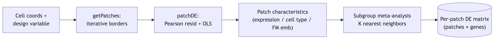{width="85%"}

### Patch definition

`getPatches()` defines patches via an iterative algorithm that
incrementally adjusts patch borders to ensure adequate statistical power
everywhere. Patches are scored by the sum of squares of the design
variable, which determines OLS power; at each iteration, low-power
patches expand into higher-power neighbors, gradually homogenizing
per-patch power. In the simplest mode, only the target cell type's xy
coordinates and design variable values are required.

A more nuanced variant was also explored: ideal patches have high
variance in the design variable while being homogeneous in everything
else, which controls confounding. This variant first applies standard
spatial clustering to partition the tissue into niches or spatial
domains and then runs `getPatches()` within each domain. The resulting
patches are more internally homogeneous (they do not span domains), at
some cost in maximum achievable power; the trade-off is expected to be
worthwhile because within-patch confounding is the more dangerous
failure mode.

### Stratified DE

For each patch, `patchDE()` performs OLS for all genes via a single
matrix multiplication, producing complete per-patch DE results in
seconds. This efficiency matters: a typical study might involve \>18,000
genes and \>1,000 patches.

### Characterizing patches

Meta-analysis requires a definition of "spatial context" --- a matrix
encoding each patch in a reasonable number of features. Several
reasonable choices are available, depending on the study design:

- Mean gene expression across all cells (or just the target cell type)
  per patch, optionally reduced to \~50 PCs.
- Cell-type abundances per patch.
- Per-patch averages of cell-level PCA embeddings, optionally with
  within-patch variance.
- Per-patch averages of foundation-model embeddings (e.g., Novae) over
  cells.

The right choice is a design question for the analyst.

### Unsupervised subgroup meta-analysis

Given per-patch DE estimates and standard errors plus the
patch-characteristics matrix, each patch's $K$ nearest neighbors in
patch-characteristic space --- intended to be biologically similar ---
are identified, and a meta-analysis is performed across the patch and
its neighbors. The unstable per-patch estimate is replaced with a more
precise, more confident regional estimate.

### Pursuing biological understanding

The output is a matrix of DE results for all patches × genes, which is
rich but daunting. The intended downstream analyses include subgroup
analyses (drawn from clinical-trial methodology) that surface
well-characterized regions where a gene's DE signal is strongest or
where results most diverge from the average patch; clustering genes into
modules and patches into groups by DE profile; and association of
per-patch DE results with covariates such as pathologist annotations or
local cell-type abundance.

## Results

A prototype of the `SpatialStratifiedDE` pipeline was applied to two
spatial datasets: a mouse colon MERFISH dataset^22^ used to study how
colon epithelial cells change with proximity to T cells after three days
of DSS-induced colitis, and a colon-cancer spatial transcriptomics
dataset^23^ used to study how tumor cells change with proximity to T
cells. Together these illustrate how patch-wise DE combined with
spatially smoothed meta-analysis surfaces localized, high-confidence DE
patterns.

### Iterative algorithm yields patches with reasonable power

[Figure 7](#fig-getpatches-power){.quarto-xref} shows the improvement of
patch power over iterations of `getPatches()` on epithelial cells of the
mouse colon MERFISH dataset^22^. Top panels show patch footprints at the
first and final iterations; bottom panels show each patch's sum of
squares of the predictor variable, which determines DE statistical
power.

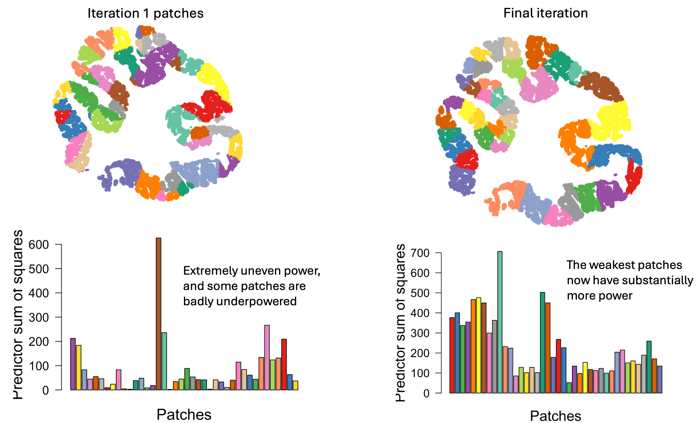{width="85%"}

### Smoothed patch meta-analysis improves statistical power

[Figure 8](#fig-meta-analysis){.quarto-xref} compares per-patch DE
results before and after meta-analysis in the colon-cancer sample
dataset^23^. Left: $t$-statistics from single-patch DE on a single gene.
Right: $z$-statistics from meta-analysis on each patch's 15 most
comparable patches (nearest neighbors in patch-composition space).

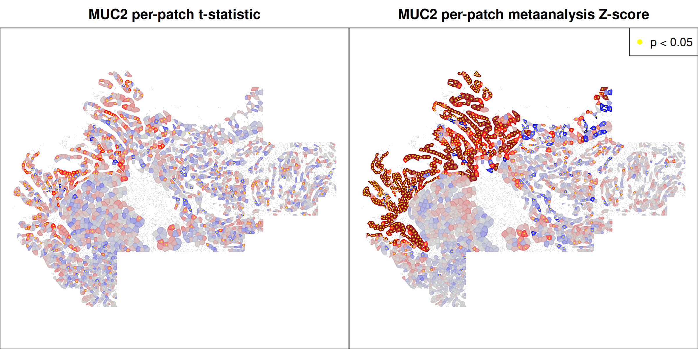{width="85%"}

## Discussion and next steps

The approach is not limited to differential expression. Any method that
produces a summary statistic and a standard error can be stratified
across patches and subjected to the same meta-analysis workflow.

Several deep questions remain open. Is this a hypothesis-testing
framework or an exploratory framework? How should the analysis account
for dependence structures among patches? How should multiple-testing
correction work when neighborhoods overlap? The methodological roadmap
centers on these issues alongside more practical refinements:
recommendations and utility functions for defining patch
characteristics, vignettes for interpreting subgroup results, an
accounting for non-independence among patches (cf. the `metapod`
package), an alternative formulation in which a patch's neighbors serve
as a prior that the patch's own data updates, and clustering of genes
and patches by per-patch DE profile.

On the code and packaging side, planned work includes a dedicated
meta-analysis function, a Bioconductor wrapper for the pipeline,
convenience functions for patch-characteristic construction, a data
package suitable for LLM-driven exploration, and vignettes and case
studies. Two outstanding decisions are whether the framework is best
positioned as hypothesis-testing or exploratory --- diagnostics will
follow from that choice --- and the final package name (working title:
`SpaceMosaic`).

The ultimate goal is to enable nuanced, confident statements like
"\[cell type\] up-regulates \[gene\] in response to \[X\] in spatial
regions with \[these characteristics\]" --- without worrying that the
result is an artifact of cryptic confounding. Defining the right
post-hoc statistics and diagnostic plots to support that claim is
ongoing work.

# Enhanced infrastructure and interoperability for spatial omics data in Bioconductor {#sec-interoperability}

Source code:

- [`SpatialData`](https://github.com/HelenaLC/SpatialData) --- R
  interface to Python's `spatialdata`
- [`SpatialData.data`](https://github.com/HelenaLC/SpatialData.data) ---
  example datasets
- [`SpatialData.plot`](https://github.com/HelenaLC/SpatialData.plot) ---
  visualization
- [`VeniceInterop`](https://github.com/HelenaLC/VeniceInterop) ---
  end-to-end workflow and relationships prototype

## Motivation

Modern spatial-omics platforms produce data that are increasingly
authored, stored, and pre-processed in the Python `scverse` ecosystem
(notably the `spatialdata` and `AnnData` packages), while Bioconductor
remains the natural downstream environment for many statistical and
biological analyses. Without a faithful bridge between the two, users
either duplicate infrastructure or choose one ecosystem at the cost of
tools that live in the other. The work described here closes that gap by
extending the R `SpatialData` package and its companions into a complete
reader, writer, and analysis surface compatible with the Python
representation, and by demonstrating end-to-end workflows that mix R and
Python tools on a single dataset.

## Methods

The `SpatialData` family of R packages implements a faithful R-side
representation of the Python `spatialdata` format and adds the lazy
access patterns required to work with it at scale. The methods below
describe the storage layers and their R readers, the companion data and
visualization packages, and the lazy spatial-subsetting pattern that
recurs across analyses.

### Storage layers and reader path

Python's
[`spatialdata`](https://spatialdata.scverse.org/en/latest/index.html)
framework is a standardized format for spatial omics, storing data as
`.zarr` files using an extension of the OME-NGFF specification^2^. The R
[`SpatialData`](https://github.com/HelenaLC/SpatialData) package
provides an R interface to `spatialdata` and integrates the resulting
representations into the Bioconductor ecosystem. *Image* and *label*
elements (e.g., microscopy and rasterized segmentation results) are
represented as `.zarr`-backed `ZarrArray`s via the
[`Rarr`](https://www.bioconductor.org/packages/Rarr/) package. *Point*
elements (e.g., transcripts) and *shape* elements (e.g., cell or nucleus
boundaries) are stored in `.parquet` and represented as lazy data frames
via [`duckspatial`](https://doi.org/10.32614/CRAN.package.duckspatial).
*Table* elements (e.g., shape annotations) are represented as
[`SingleCellExperiment`](https://bioconductor.org/packages/SingleCellExperiment/)
objects, read directly from `AnnData` via
[`anndataR`](https://bioconductor.org/packages//release/bioc/html/anndataR.html)^24^.

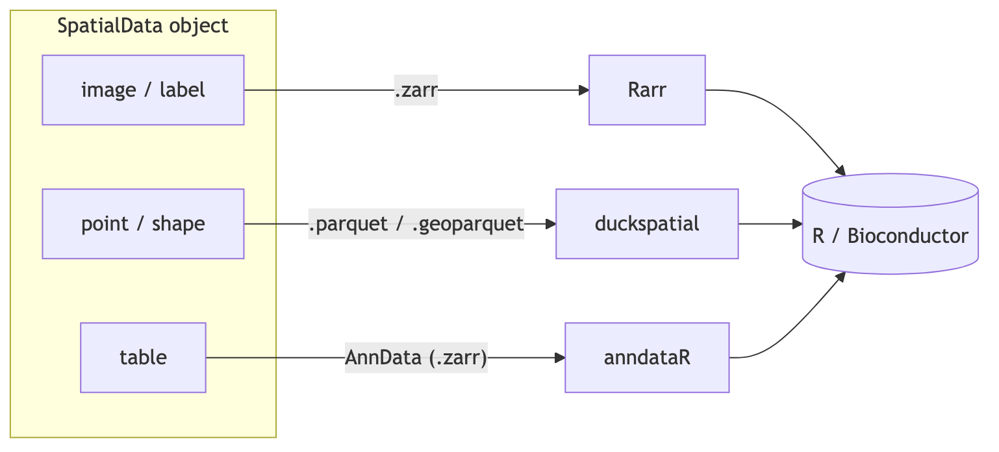{width="85%"}

Because tabular information lands in `SingleCellExperiment`,
interoperability with Bioconductor's existing single-cell infrastructure
is preserved. The on-disk representations of the other components
support efficient lazy access via `Rarr` and `duckspatial`. Available
functionality includes spatial queries by rectangular bounding box or
polygon, and masking between elements to aggregate information across
layers.

### Companion packages

Two companion packages provide modular `SpatialData` infrastructure.
[`SpatialData.data`](https://github.com/HelenaLC/SpatialData.data)
supplies toy and realistic example datasets (sequencing- and
imaging-based), and
[`SpatialData.plot`](https://github.com/HelenaLC/SpatialData.plot)
handles visualization --- including layered plots that overlay
segmentation, mRNA molecules, and high-plex or histopathology imagery.
An online gallery is under active development at
<https://helenalc.github.io/SpatialData>.

### Lazy spatial subsetting via `duckspatial`

Spatial subsetting emerged as a fundamental, recurring operation across
analyses. These operations apply to potentially very large on-disk data
--- millions of transcript points or cells --- and must avoid
materializing the whole dataset in memory. The implementation uses
[`duckspatial`](https://cran.r-project.org/web/packages/duckspatial/index.html),
which exposes the spatial extension of [DuckDB](https://duckdb.org/)
from R: spatial filtering is compiled to SQL and executed by the
database engine, loading only the matched rows. For example, transcripts
overlapping a selected cell or within a region of interest can be
efficiently extracted from a Parquet file with hundreds of millions of
rows. Query regions can be rectangular bounding boxes or arbitrary
polygons. This pattern is now used by the `query` method for both points
and shapes in `SpatialData`.

## Results

The work delivered an end-to-end interoperability demonstration that
crosses the Python/R boundary on a single dataset, plus a prototype
redesign of how relationships across `SpatialData` elements are encoded
and explored.

### End-to-end workflow

To demonstrate the current capabilities and interoperability with
existing R/Bioconductor tools, an end-to-end workflow was built that
reads results from [`SegTraQ`](https://github.com/LazDaria/SegTraQ) ---
a Python framework for cell segmentation and transcript-assignment QC
--- into R, applies two downstream analyses (RCTD-based signal purity
scoring via
[`spacexr`](https://bioconductor.org/packages//release/bioc/html/spacexr.html)^25^
and delineation of multicellular anatomical structures via
[`sosta`](https://bioconductor.org/packages//release/bioc/html/sosta.html)^26^),
and visualizes the results spatially with `SpatialData.plot`. The full
workflow --- read data written by Python's `spatialdata`, compute QC
scores and anatomical structures, visualize subsets --- is summarized in
[Figure 10](#fig-spatialdata-overview){.quarto-xref}, with
image-specific visualization shown in
[Figure 11](#fig-spatialdataplot-images){.quarto-xref}. An R Markdown
source plus rendered HTML is published at
<https://github.com/HelenaLC/VeniceInterop>.

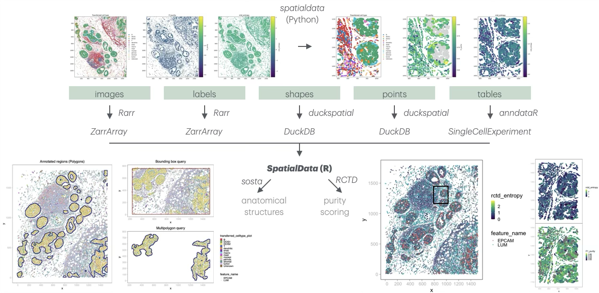

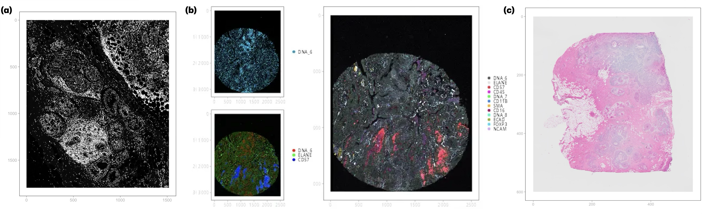

### Relationships across `SpatialData` elements

As a side project, a new design for encoding and exploring relationships
across `SpatialData` elements --- both within and across `SpatialData`
objects --- was prototyped. Improving the design and exploration of
relationship metadata is a prerequisite for broader adoption across
packages and languages. The prototype was illustrated on the same Xenium
subset used above, complemented with four additional `SpatialData`
objects covering further modalities, and accompanied by an interactive
viewer (`graph_all.html`); the code is in
<https://github.com/HelenaLC/VeniceInterop/tree/main/relationships>.

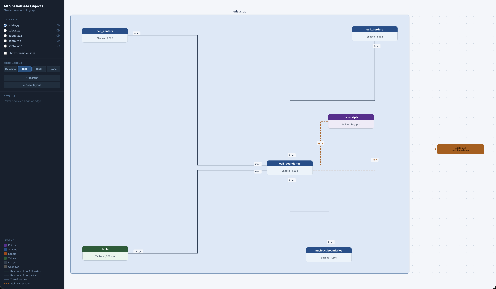{width="80%"}

## Discussion and next steps

R `SpatialData` development began more than two years ago^27^, but full
functionality awaited several infrastructural pieces --- notably delayed
`.zarr` support and `AnnData` interoperability. The hackathon delivered
three concrete advances: lazy handling of points (from `.parquet`) and
shapes (from `.geoparquet`) via `duckspatial`; demonstrated
interoperability with existing R/Bioconductor tools for spatial omics
analysis; and improved visualization in `SpatialData.plot`, with an
approximately ten-fold speedup and automatic contrast adjustment.

Continued co-design with the Python `spatialdata` developers is
essential to keep the two ecosystems coherent as both evolve. Priorities
for the next phase are upstreaming the relationship-encoding prototype,
expanding the example gallery to cover additional modalities and
analysis patterns, and validating the lazy-query pattern on the largest
available datasets where its memory advantages should be clearest.

# Discussion {#sec-discussion}

The four projects reported here address complementary layers of the
spatial-omics stack. Team 1 tackled the raster--polygon bottleneck that
has historically kept R/Bioconductor away from gigapixel digital
pathology, and shows that pairing OME-Zarr with GeoParquet and pushing
spatial queries to DuckDB makes whole-slide analysis tractable on a
laptop. Team 2 lowered the bar for using spatial foundation models from
R by isolating each model in its own Python environment and exposing a
uniform `Run_*()` interface, turning what is currently a per-model setup
project into a package install. Team 3 prototyped a spatially stratified
differential expression framework that lets the location of an effect,
not just its magnitude, become a first-class output of an analysis. Team
4 demonstrated end-to-end interoperability between Python's
`spatialdata` and the R `SpatialData` family, with `duckspatial`-backed
lazy queries and large gains in visualization performance.

A consistent theme across teams is that the hard problem in scaling
spatial analysis is not algorithmic but representational: choosing
on-disk formats and access patterns that let the rest of the toolchain
stay expressive and interactive. GeoParquet, OME-Zarr, and DuckDB recur
because they let R code stay declarative while pushing the heavy lifting
to indexed, chunked storage.

Several open questions remain. The patch-stratified DE framework needs
to clarify whether it is best framed as hypothesis testing or as an
exploratory tool, and to settle on the right multiple-testing model for
non-independent neighborhoods. The foundation-models package has to
handle models that are not on PyPI without forcing every user to
provision their own environment. The `SpatialData` infrastructure work
needs continued co-design with the Python `spatialdata` developers to
keep the two ecosystems coherent.

All software produced during the hackathon is open and under active
development; we welcome contributions, issues, and use cases from the
community.

# Code and data availability

All software developed during the hackathon is hosted in public GitHub
repositories linked from the relevant team sections; those repositories
remain the active development homes. A consolidated snapshot of the work
as it stood at the close of the hackathon, organized by team into
per-project folders, is also available at
<https://github.com/BiocCodingCollaborations/VeniceHackathon2026>.

# Author contributions

H.C., L.M., W.H., and D.R. organized and led the hackathon. S.D.
coordinated the production of the preprint manuscript. All authors
participated in one or more team projects and contributed to the
manuscript.

# Use of AI tools

Claude (Anthropic, model `claude-opus-4-7`) was used to convert
team-authored Google Docs into this Quarto project, scaffold the CI/CD
workflow, and propose structural edits --- including the table in
[Table 2](#tbl-image-stack){.quarto-xref} and the diagrams in
[Figure 9](#fig-spatialdata-layers){.quarto-xref} and
[Figure 6](#fig-stratified-de-pipeline){.quarto-xref}. The authors
reviewed all AI output and retain full responsibility for the
manuscript's content.

# Acknowledgements

The event was organized by the Department of Statistical Sciences of the
University of Padova in collaboration with Venice International
University. It was funded in part by the European Research Council (ERC)
Grant CoG 101171662 and supported by EMBL's Transversal Theme
Theory@EMBL. We thank Elena Guzzonato for her help with the organization
of the event. S.D. acknowledges support from NCI U24CA289073. R.C. and
P.M-S. acknowledge support from grants PID2024-158127NB-I00 funded by
MICIU/AEI /10.13039/501100011033 and by "ERDF: A way of making Europe",
and 2022-311145 funded by the Chan Zuckerberg Initiative DAF, an advised
fund of Silicon Valley Community Foundation.

:::::::::::::::::::::::::::::: {#refs .references .csl-bib-body entry-spacing="0" line-spacing="2"}
::: {#ref-tcia2013ov .csl-entry}
[1. ]{.csl-left-margin}[The Cancer Imaging Archive. The cancer genome
atlas ovarian cancer collection (TCGA-OV). (2013)
doi:[10.7937/K9/TCIA.2013.V7FRLZ1D](https://doi.org/10.7937/K9/TCIA.2013.V7FRLZ1D).]{.csl-right-inline}
:::

::: {#ref-marconato2024spatialdata .csl-entry}
[2. ]{.csl-left-margin}[[Marconato, L. *et al.*]{.nocase} SpatialData:
An open and universal data framework for spatial omics. *Nature Methods*
<https://doi.org/10.1038/s41592-024-02212-x> (2024)
doi:[10.1038/s41592-024-02212-x](https://doi.org/10.1038/s41592-024-02212-x).]{.csl-right-inline}
:::

::: {#ref-pebesma2018sf .csl-entry}
[3. ]{.csl-left-margin}[Pebesma, E. [Simple features for r: Standardized
support for spatial vector data](https://doi.org/10.32614/RJ-2018-009).
*The R Journal* **10**, 439--446 (2018).]{.csl-right-inline}
:::

::: {#ref-baddeley2005spatstat .csl-entry}
[4. ]{.csl-left-margin}[Baddeley, A. & Turner, R. [[spatstat]{.nocase}:
An R package for analyzing spatial point
patterns](https://doi.org/10.18637/jss.v012.i06). *Journal of
Statistical Software* **12**, (2005).]{.csl-right-inline}
:::

::: {#ref-imageTCGA .csl-entry}
[5. ]{.csl-left-margin}[Billato, I. *[imageTCGA]{.nocase}: TCGA
Diagnostic Image Database Explorer*. (2026).
doi:[10.18129/B9.bioc.imageTCGA](https://doi.org/10.18129/B9.bioc.imageTCGA).]{.csl-right-inline}
:::

::: {#ref-graham2019hovernet .csl-entry}
[6. ]{.csl-left-margin}[Graham, S. *et al.* [Hover-net: Simultaneous
segmentation and classification of nuclei in multi-tissue histology
images](https://doi.org/10.1016/j.media.2019.101563). *Medical Image
Analysis* **58**, 101563 (2019).]{.csl-right-inline}
:::

::: {#ref-terra .csl-entry}
[7. ]{.csl-left-margin}[Hijmans, R. J., Brown, A. & Barbosa, M.
*[terra]{.nocase}: Spatial Data Analysis*. (2026).
doi:[10.32614/CRAN.package.terra](https://doi.org/10.32614/CRAN.package.terra).]{.csl-right-inline}
:::

::: {#ref-duckspatial .csl-entry}
[8. ]{.csl-left-margin}[Cidre González, A., Kotov, E. & Pereira, R. H.
M. *[duckspatial]{.nocase}: R Interface to 'DuckDB' Database with
Spatial Extension*. (2026).
doi:[10.32614/CRAN.package.duckspatial](https://doi.org/10.32614/CRAN.package.duckspatial).]{.csl-right-inline}
:::

::: {#ref-zarrarray .csl-entry}
[9. ]{.csl-left-margin}[Pagès, H., Smith, M., Gruson, H. & Manukyan, A.
*ZarrArray: Bring Zarr Datasets in R as DelayedArray Objects*. (2026).
doi:[10.18129/B9.bioc.ZarrArray](https://doi.org/10.18129/B9.bioc.ZarrArray).]{.csl-right-inline}
:::

::: {#ref-delayedarray .csl-entry}
[10. ]{.csl-left-margin}[Pagès, H. *DelayedArray: A Unified Framework
for Working Transparently with on-Disk and in-Memory Array-Like
Datasets*. (2026).
doi:[10.18129/B9.bioc.DelayedArray](https://doi.org/10.18129/B9.bioc.DelayedArray).]{.csl-right-inline}
:::

::: {#ref-plotly .csl-entry}
[11. ]{.csl-left-margin}[Sievert, C. *et al.* *[[plotly]{.nocase}:
Create Interactive Web Graphics via
'Plotly.js'](https://CRAN.R-project.org/package=plotly)*.
(2024).]{.csl-right-inline}
:::

::: {#ref-petukhovcell2022 .csl-entry}
[12. ]{.csl-left-margin}[Petukhov, V. *et al.* *[Cell Segmentation in
Imaging-Based Spatial
Transcriptomics](https://doi.org/10.1038/s41587-021-01044-w)*. *Nature
Biotechnology* vol. 40 345--354 (2022).]{.csl-right-inline}
:::

::: {#ref-merfishdata .csl-entry}
[13.
]{.csl-left-margin}[*[MerfishData](http://bioconductor.org/packages/MerfishData/)*.
*Bioconductor* (2026).]{.csl-right-inline}
:::

::: {#ref-tidyterra .csl-entry}
[14. ]{.csl-left-margin}[Hernangómez, D. *[Using the Tidyverse with
Terra Objects: The Tidyterra
Package](https://doi.org/10.21105/joss.05751)*. *Journal of Open Source
Software* vol. 8 5751 (2023).]{.csl-right-inline}
:::

::: {#ref-cui2024scgpt .csl-entry}
[15. ]{.csl-left-margin}[Cui, H. *et al.* [scGPT: Toward building a
foundation model for single-cell multi-omics using generative
AI](https://doi.org/10.1038/s41592-024-02201-0). *Nature Methods*
**21**, 1470--1480 (2024).]{.csl-right-inline}
:::

::: {#ref-hao2024scfoundation .csl-entry}
[16. ]{.csl-left-margin}[Hao, M. *et al.* [Large-scale foundation model
on single-cell
transcriptomics](https://doi.org/10.1038/s41592-024-02305-7). *Nature
Methods* **21**, 1481--1491 (2024).]{.csl-right-inline}
:::

::: {#ref-blampey2024novae .csl-entry}
[17. ]{.csl-left-margin}[Quentin, B., Hakim, B., Nadège, B., Fabrice, A.
& Paul-Henry, C. Novae: A graph-based foundation model for spatial
transcriptomics data. *bioRxiv*
<https://doi.org/10.1101/2024.09.09.612009> (2024)
doi:[10.1101/2024.09.09.612009](https://doi.org/10.1101/2024.09.09.612009).]{.csl-right-inline}
:::

::: {#ref-xu2024gigapath .csl-entry}
[18. ]{.csl-left-margin}[[Xu, H. *et al.*]{.nocase} [A whole-slide
foundation model for digital pathology from real-world
data](https://doi.org/10.1038/s41586-024-07441-w). *Nature* **630**,
181--188 (2024).]{.csl-right-inline}
:::

::: {#ref-rumberger2025automated .csl-entry}
[19. ]{.csl-left-margin}[[Rumberger, J. L. *et al.*]{.nocase} Automated
classification of cellular expression in multiplexed imaging data with
nimbus. *Nature Methods* **22**, 2161--2170 (2025).]{.csl-right-inline}
:::

::: {#ref-shaban2025foundation .csl-entry}
[20. ]{.csl-left-margin}[[Shaban, M. *et al.*]{.nocase} A foundation
model for spatial proteomics. *arXiv preprint arXiv:2506.03373*
(2025).]{.csl-right-inline}
:::

::: {#ref-wang2025scgptspatial .csl-entry}
[21. ]{.csl-left-margin}[Wang, C. *et al.* scGPT-spatial: Continual
pretraining of single-cell foundation model for spatial transcriptomics.
*bioRxiv* 2025--02 (2025).]{.csl-right-inline}
:::

::: {#ref-cadinu2024mousecolon .csl-entry}
[22. ]{.csl-left-margin}[Cadinu, P. *et al.* [Charting the cellular
biogeography in colitis reveals fibroblast trajectories and coordinated
spatial remodeling](https://doi.org/10.1016/j.cell.2024.03.013). *Cell*
**187**, 2010--2028.e30 (2024).]{.csl-right-inline}
:::

::: {#ref-colon2025 .csl-entry}
[23. ]{.csl-left-margin}[Crowell, H. L. *et al.* Tracing colorectal
malignancy transformation from cell to tissue scale. *bioRxiv*
2025.06.23.660674 (2025)
doi:[10.1101/2025.06.23.660674](https://doi.org/10.1101/2025.06.23.660674).]{.csl-right-inline}
:::

::: {#ref-anndataR2025 .csl-entry}
[24. ]{.csl-left-margin}[Deconinck, L. *et al.* [anndataR]{.nocase}
improves interoperability between R and Python in single-cell
transcriptomics. *bioRxiv* 2025.08.18.669052 (2025)
doi:[10.1101/2025.08.18.669052](https://doi.org/10.1101/2025.08.18.669052).]{.csl-right-inline}
:::

::: {#ref-cable2022rctd .csl-entry}
[25. ]{.csl-left-margin}[Cable, D. M. *et al.* [Robust decomposition of
cell type mixtures in spatial
transcriptomics](https://doi.org/10.1038/s41587-021-00830-w). *Nature
Biotechnology* **40**, 517--526 (2022).]{.csl-right-inline}
:::

::: {#ref-sosta2025 .csl-entry}
[26. ]{.csl-left-margin}[Gunz, S., Crowell, H. L. & Robinson, M. D.
Analysis of multicellular anatomical structures from spatial omics data
using [sosta]{.nocase}. *bioRxiv*
<https://doi.org/10.1101/2025.10.13.682065> (2025)
doi:[10.1101/2025.10.13.682065](https://doi.org/10.1101/2025.10.13.682065).]{.csl-right-inline}
:::

::: {#ref-spatialdataR2024 .csl-entry}
[27. ]{.csl-left-margin}[Marconato, L. *et al.* 1st SpatialData
developer workshop. <https://doi.org/10.37044/osf.io/8ck3e> (2024)
doi:[10.37044/osf.io/8ck3e](https://doi.org/10.37044/osf.io/8ck3e).]{.csl-right-inline}
:::
::::::::::::::::::::::::::::::
